<div align="center">

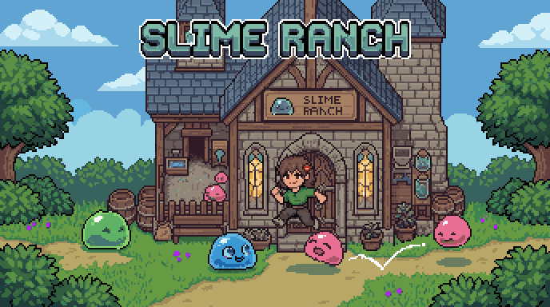

# 슬라임 목장 — Slime Ranch

**귀여운 슬라임을 잡고, 짝지어 키우고, 수배된 보스 슬라임을 잡아요!**

[](https://ys143112.github.io/Slime/)
[](https://unity.com/)
[](https://docs.unity3d.com/Packages/com.unity.render-pipelines.universal@latest)

설치 필요 없음 · 마우스와 키보드만 준비!!· 한 판 5~10분

</div>

---

## 🎮 어떤 게임인가요?

> 여러분은 **슬라임 목장 주인**이에요.
>
> 숲으로 나가서 슬라임을 잡아 오고,  
> 잡아온 슬라임들을 교배시켜 **강하고 희귀한 슬라임**을 키워   
> 마지막엔 **수배범 슬라임**을 잡아요!

세 문장으로 끝나는 게임이에요:

| | 무엇을 하나요 | 왜 하나요 |
|---|---|---|
| 1️⃣ | **잡아라!** — 슬라임을 때려서 힘 빠지게 한 뒤 `E` 로 잡아요 | 내 슬라임이 늘어나요 |
| 2️⃣ | **키워라!!** — 슬라임 둘을 짝지으면 알이 나와요 | 가끔 **돌연변이**·**반짝이(이로치)** 가 나와요 |
| 3️⃣ | **더 잡아라!!!** — 숲마다 한 마리씩 **수배 슬라임**이 숨어 있어요 | 이게 이 게임의 **최종 목표** 🏆 |

<div align="center">

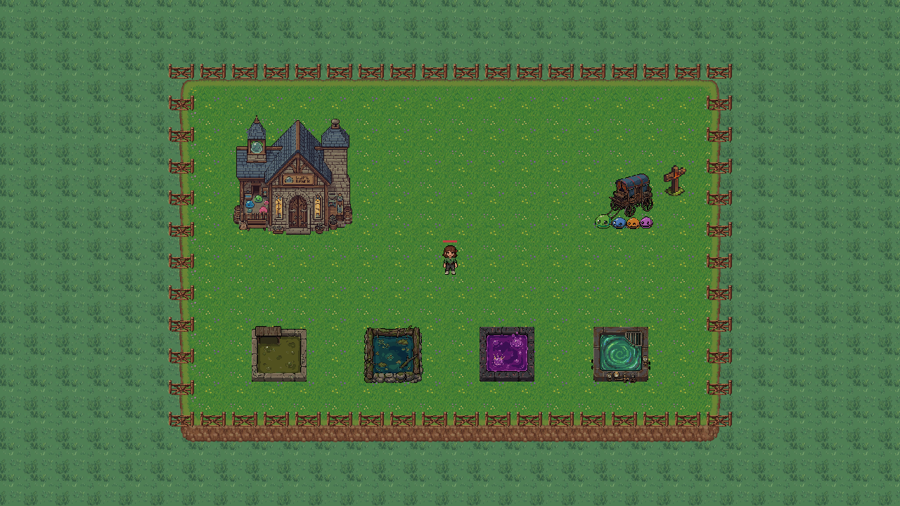 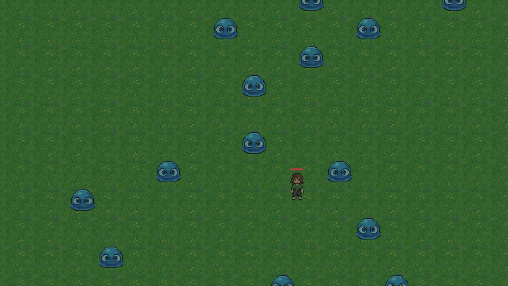

<sub>왼쪽 : 내 목장 (집·마차·휴식 웅덩이) &nbsp;·&nbsp; 오른쪽 : 숲에서 야생 슬라임을 만난 순간</sub>

</div>

---

## 🔁 한 판은 이렇게 흘러가요

```
 목장에서 준비  →  마차 타고 숲으로  →  슬라임 잡기  →  살아서 돌아오기  →  짝지어 키우기  →  다시 숲으로
```

1. **목장에서 준비해요.** 다친 슬라임은 웅덩이에 넣어 쉬게 하고, 데리고 갈 친구 한 마리를 고릅니다.
2. **마차를 타면 숲으로 들어가요.** 숲은 들어갈 때마다 **지도가 새로 만들어져요** — 매번 다른 모양입니다.
3. **슬라임을 잡아요.** 마우스 왼쪽 버튼으로 세 번 때리면 슬라임이 힘이 빠져 주저앉아요. 그때 `E` 를 누르면 가방에 쏙!
4. **⚠️ 살아서 돌아와야 내 것이 돼요.** 숲 어딘가에 있는 **추출구(집으로 가는 문)** 까지 걸어가야 합니다.
   길을 잃어도 괜찮아요 — 화면의 **화살표가 추출구 쪽을 가리켜요.**
   중간에 내가 쓰러지면 **그 판에 잡은 슬라임은 전부 사라져요.** 이게 이 게임에서 제일 조마조마한 부분이에요.
5. **목장에서 짝지어요.** `U` 를 눌러 부모 두 마리를 고르면 알이 나오고, 알에서 새 슬라임이 태어납니다.  
*( 아쉽게도 짝짓기를 마친 슬라임들은 힘들 다 소모해서 소멸되요ㅠㅠ )*

<div align="center">

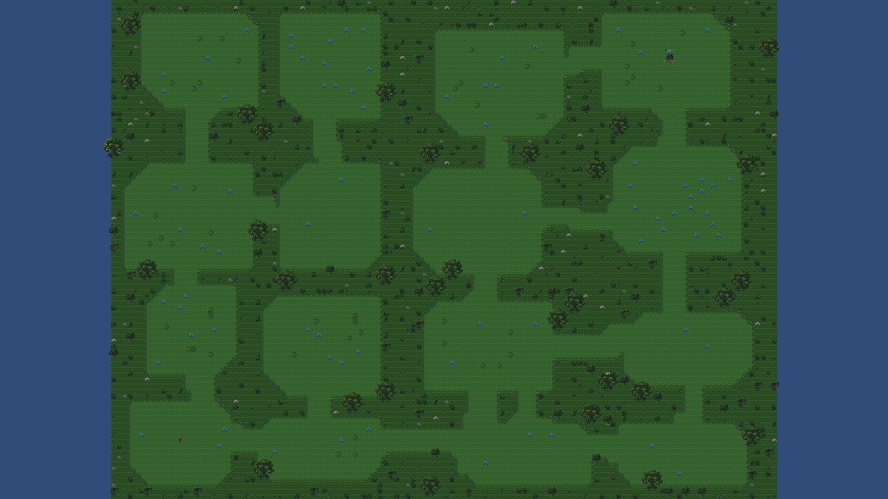

<sub>숲 지도는 들어갈 때마다 새로 그려져요 (실제로는 가 본 곳만 밝게 보입니다)</sub>

</div>

---

## 🗺️ 숲은 세 곳이에요

같은 게임인데 **가는 곳마다 색도, 사는 슬라임도, 나오는 반짝이 색도 달라요.**
*(지금 버전에서 마차는 초원으로 이어져요 — 늪지대와 잿벌은 다음에 열려요!)*

<div align="center">

| 🌿 초원 | 🪵 늪지대 | 🌋 잿벌 |
|:---:|:---:|:---:|
|  | 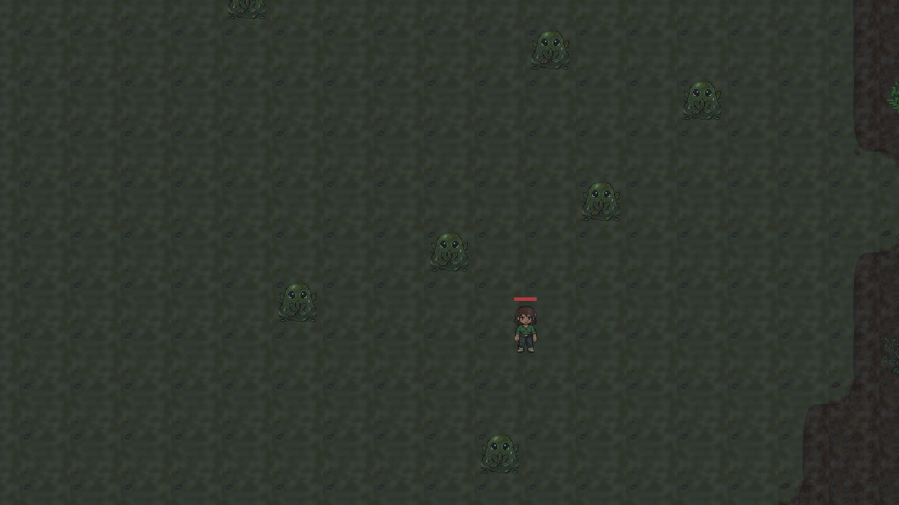 | 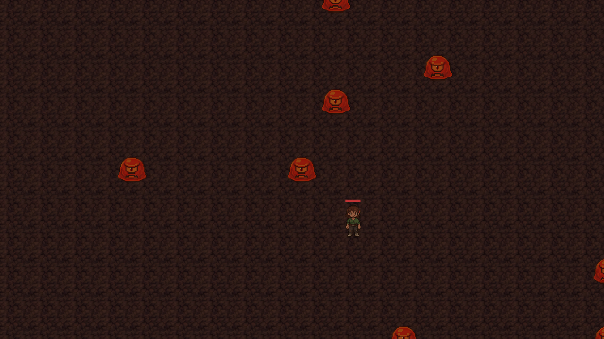 |
| 밝고 넓은 풀밭 | 어둡고 축축한 진흙탕 | 뜨겁고 새까만 화산재 |
| **파란 슬라임 · 방패 슬라임** | **늪 슬라임** | **용암 슬라임** |
| 반짝이 색 규칙 없음 | 반짝이 = **초록** | 반짝이 = **빨강** |
|  | 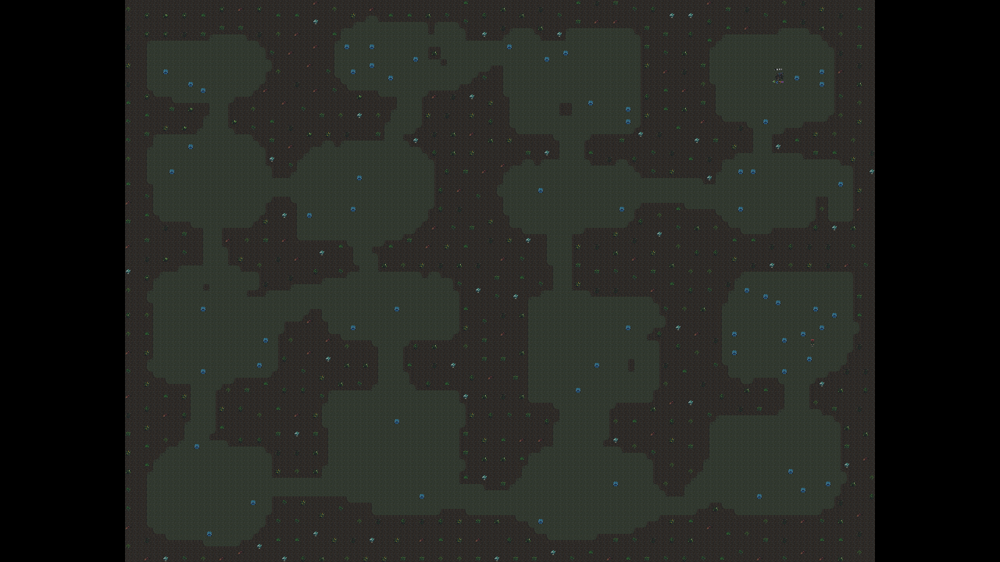 | 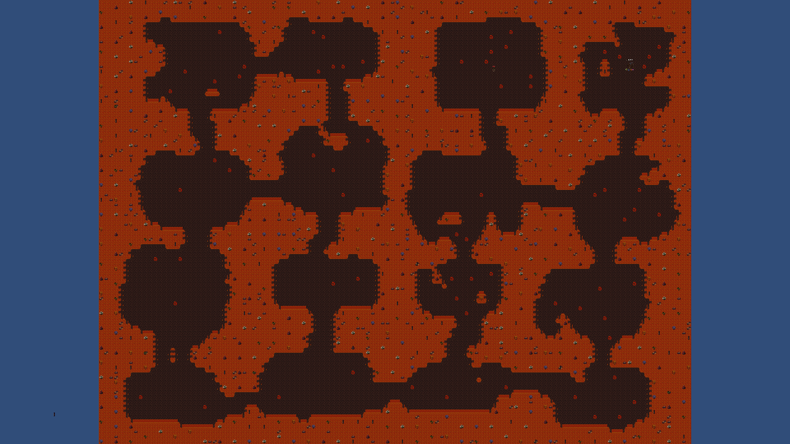 |

<sub>아래 줄은 각 숲의 지도 전체 모습이에요 — 방과 길이 매번 새로 만들어집니다</sub>

</div>

---

## 🧫 슬라임 도감

종류마다 **생김새가 다르고, 잘하는 것도 달라요.** 게임 안에서 `J` 를 누르면 내가 만난 슬라임이 기록됩니다.

| 그림 | 이름 | 어디서 만나나요 | 특징 | 가지고 다니면 좋은 점 |
|:---:|---|---|---|---|
| 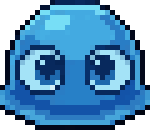 | **파란 슬라임** | 모든 숲 | 평범해요. 제일 많이 만나요 | — |
| 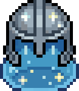 | **방패 슬라임** | 초원 | 아주 튼튼하지만 **공격을 못 해요** | 적이 나 대신 이 친구를 노려요 (방패 역할) |
| 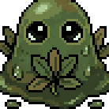 | **늪 슬라임** | 늪지대 | 축축한 초록색 | 가까이 온 적을 **느리게** 만들어요 |
| 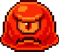 | **용암 슬라임** | 잿벌(화산재) | 모든 능력이 조금씩 높아요 | 가까이 온 적을 **계속 태워요** |
| 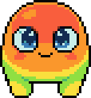 | **무지개 슬라임** | **잡을 수 없어요! 오직 교배로만** (약 5%) | 능력은 조금 낮아요 | 주변을 **치료해요** — 단, 적도 같이 나아요 😅 |

<div align="center">
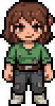<br>
<sub>여러분이 조종하는 목장 주인이에요</sub>
</div>

---

## ✨ 돌연변이와 반짝이 슬라임

가끔 **평범하지 않은 슬라임**이 나와요.

- **돌연변이** — 능력치가 **뒤집힌** 슬라임이에요. 약한 대신 다른 게 세거나, 그 반대로요.
  기본 확률은 **5%**, 숲이 위험해질수록 **한 단계마다 +2%** 올라가요.
- **반짝이(이로치)** — 돌연변이 중에서 다시 **25%** 확률로 나오는 **색이 다른 슬라임**이에요. 아주 귀해요! 🌟
  전부 곱하면 **100마리에 한두 마리**(1.25%) 꼴이에요.
  색은 숲마다 달라요 (늪지대 = 초록, 잿벌 = 빨강). 색 규칙이 없는 숲에서는 반짝이가 아예 안 나와요.
- **50번 동안 한 번도 못 만나면** 다음 한 마리는 **반드시** 돌연변이로 나와요 (봐주기 장치).

지금 확률이 몇 %인지는 게임 화면 **오른쪽 위**에 항상 떠 있어요 — 계산할 필요 없어요!

<div align="center">

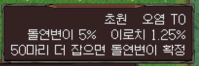

<sub>`초원 · 오염 T0 · 돌연변이 5% · 이로치 1.25%` — 그리고 "50마리 더 잡으면 돌연변이 확정"까지 알려줘요</sub>

</div>

---

## 🔥 낙인 — 같은 숲만 계속 가면 위험해져요

같은 숲에 자꾸 들어가면 그 숲에 **낙인**이 쌓여요.

- 낙인 **3개마다 위험도 1단계** 상승 (최대 5단계)
- 한 단계마다 야생 슬라임이 **15% 더 강해져요**
- 대신 **돌연변이와 반짝이가 나올 확률도 같이 올라가요**

👉 *안전하게 갈까, 아니면 위험을 무릅쓰고 귀한 슬라임을 노릴까?* — 이 선택이 게임의 핵심이에요.

---

## 🏆 최종 목표 : 수배 슬라임을 잡아라

<div align="center">
<br>
<sub><b>WANTED</b> — 숲 가장 깊은 방에서 기다립니다</sub>
</div>

숲에 들어갈 때마다 **딱 한 마리, 특별히 강해진 슬라임**이 가장 위험한 방에 나타나요.

| | 보통 슬라임 대비 |
|---|---|
| 체력 | **3배** |
| 공격력 | **1.6배** |
| 방어력 | **1.5배** |

혼자서는 어려워요. **슬라임을 짝지어 더 센 아이를 만들고, 친구로 데려가서** 함께 잡는 것이 이 게임을 끝내는 방법입니다.
잡으면 **추출에 실패해도 기록은 남아요** — 도전은 헛되지 않아요!

---

## ⌨️ 조작법

| 키 | 하는 일 | | 키 | 하는 일 |
|:---:|---|---|:---:|---|
| `W` `A` `S` `D` | 움직이기 | | `I` | 내 슬라임 목록 |
| **마우스 왼쪽** | 공격 | | `U` | 짝짓기(교배) 창 — 목장에서만 |
| `E` | 힘 빠진 슬라임 잡기 | | `B` | 이번 판에 잡은 가방 |
| `J` | 도감 | | `Z` `X` `C` | 목장 시설 쓰기 |
| `H` | 화면 도움말 접기 | | `Esc` | 잠깐 멈추기 / 설정 |

조작키는 **게임 화면 오른쪽 아래에도 항상 적혀 있어요.** 가리고 싶으면 `H` 를 누르면 돼요.

---

## 👀 게임 화면 구경하기

<div align="center">

| `I` — 내 슬라임 목록 | `U` — 짝짓기(교배) 창 |
|:---:|:---:|
| 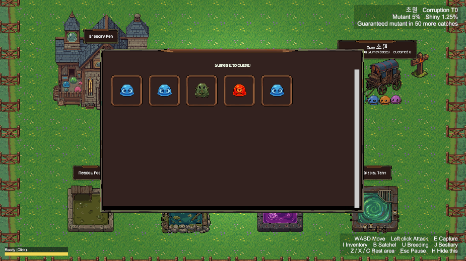 | 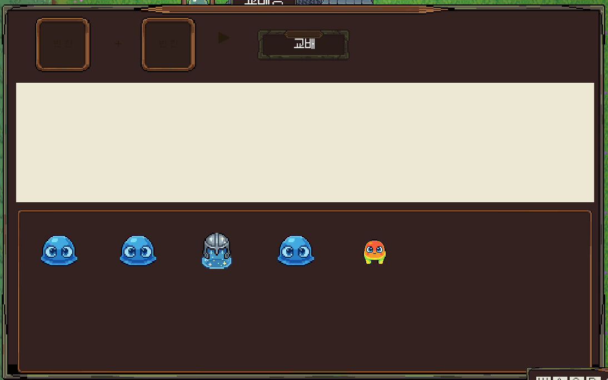 |
| 잡은 슬라임이 칸칸이 놓여요. 마우스를 올리면 그 아이의 능력이 쪽지로 떠요 | 부모 둘을 고르고 **교배** 를 누르면 알이 나와요 |

| `J` — 도감 | |
|:---:|:---:|
| 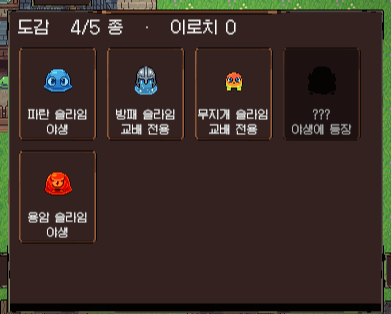 | 한 번이라도 만난 슬라임은 여기에 기록돼요.<br>아직 못 만난 아이는 **???** 로 가려져 있어요.<br>맨 위에 `5종 중 몇 종`, `이로치 몇 마리` 가 나와요 |

</div>

---

<details>
<summary><b>🧑‍💻 개발자를 위한 안내 (클릭해서 펼치기)</b></summary>

### 실행 방법

Unity **6000.5.5f1** 로 프로젝트를 열고 **`Assets/Scenes/Boot.unity` 에서 Play** 를 누른다.
다른 씬에서 바로 Play 하면 `GameManager` 등 영속 싱글턴이 없어 동작하지 않는다.
시작 화면에서 "시작하기" 를 눌러야 목장으로 들어간다.

### 문서 지도

| 알고 싶은 것 | 볼 곳 |
|---|---|
| 저장소 어디에 뭐가 있는지 | **[MAP.md](MAP.md)** — 표지판 |
| 게임 시스템 요약 | [GAME_OVERVIEW_SHORT.md](GAME_OVERVIEW_SHORT.md) |
| 코드 구조 (파일 한 줄 설명) | [Assets/Scripts/INDEX.md](Assets/Scripts/INDEX.md) |
| 자산 구조 | [Assets/INDEX.md](Assets/INDEX.md) |
| 규칙 · 겪은 함정 전부 | [CLAUDE.md](CLAUDE.md) (42KB, 절 단위로 읽을 것) |
| 스테이지 생성 설계 | [STAGE_A_DESIGN.md](STAGE_A_DESIGN.md) |

### 구조 한눈에

```
Assets/
├─ Scenes/      Boot(부팅·타이틀) → Hub(목장) / Biome·BiomeMarsh·BiomeAshfall(숲 3종)
├─ Scripts/     Data · Player · Systems · UI · World   (어셈블리: Game.Gameplay)
├─ SO/          BiomeCatalog · Species/ · 유전·산출 테이블
├─ Art/         원본 GIF·타일 시트 → SlimeStrips/ 로 펴서 사용
├─ Animations/  Player/Slime 컨트롤러 + Species/*.controller (빌더가 생성)
└─ Tests/       PlayMode 테스트
```

- **영속 싱글턴은 전부 Boot 씬에 있다**: `GameManager` `PlayerRoster` `BiomeStigmaManager`
  `CorruptedGeneTagger` `LineageEvolutionChecker` `InventoryUI` `EventSystem`.
- 화면에 늘 뜨는 HUD·도감은 씬이 아니라 **코드로 만든다**(`HudRoot`) — 씬 병합 사고를 피하기 위한 선택.

### 그림을 새로 넣었을 때 (자산 파이프라인)

```bash
python Tools/extract_slime_strips.py   # GIF → 스트립 PNG (Unity GIF 임포터는 첫 프레임만 가져온다)
python Tools/apply_tile_sheets.py      # 타일 시트 → wang 16장
```

그다음 Unity 메뉴 `SlimeRanch/Build Actor Animations`. **두 단계는 세트다** — 파이썬만 돌리면
클립이 삭제된 스프라이트를 가리킨다. 이유는 [CLAUDE.md](CLAUDE.md) 「배우 애니메이션」 절에 있다.

### 배포 (GitHub Pages)

```bash
git worktree add --orphan -B gh-pages ../slime-pages
cp -r Build/WebGL/. ../slime-pages/ && touch ../slime-pages/.nojekyll
cd ../slime-pages && git add -A && git commit -m "chore: WebGL 빌드" && git push -f origin gh-pages
```

Brotli 압축은 켠 채로 둔다 — 로더의 `decompressionFallback` 이 브라우저에서 직접 풀어 준다.

### 브랜치

기능별 `feat-*` → `dev` → `main`.
씬(`.unity`)을 건드린 브랜치를 머지한 뒤에는 오브젝트가 통째로 사라지지 않았는지 확인한다
(`grep -c "^--- !u!" before after`, [CLAUDE.md](CLAUDE.md) 「씬 병합 함정」).

### 이 README 의 스크린샷 다시 찍기

`Docs/img/` 안의 그림은 Unity 에디터(Play 모드 아님)에서 카메라를 RenderTexture 로 렌더해 저장한 것이다.

- `hub.png` — Hub 씬 그대로 (손배치라 에디터에서도 완성돼 있다)
- `biome.png` `marsh.png` `ashfall.png` (지도 전체) / `dive.png` `marsh_dive.png` `ashfall_dive.png` (ortho 5 근접) —
  각 바이옴 씬에서 `StageMapGenerator.Generate()` + `SlimeSpawner.Spawn()` 을 호출한 뒤 촬영.
  스포너는 `GameManager` 가 없는 에디터에서 전부 `slime_basic` 으로 나오므로 촬영 전
  `WildSlimeAgent.Initialize("slime_bog"/"slime_lava", tier)` 로 종을 바꿨고,
  `LineRenderer`(패시브 반경 원)는 화면이 지저분해져 껐다. **씬은 저장하지 않았다.**
- 종별 얼굴 그림은 `Assets/Art/SlimeStrips/*__Idle__south.png` 스트립의 첫 프레임을 잘라 4배 확대.

RunCommand 함정 두 가지: `EditorSceneManager.OpenScene` 을 `ClearSceneDirtiness` 뒤에 부르면
로그 없이 통째로 실패한다(씬 전환은 `Unity_ManageScene Action=Load` 로 할 것). 그리고
`CommandScript` 안에 `static` 헬퍼 메서드를 두면 같은 증상으로 죽는다 — 전부 `Execute` 안에 인라인할 것.

### 화면 UI 가 스크린샷에 안 나오는 이유

HUD·인벤토리·교배창·도감은 Screen Space Overlay 캔버스(`HudRoot`)라 **카메라 렌더에 안 잡힌다.**
그 화면들이 필요하면 Play 모드나 WebGL 빌드에서 직접 캡처해야 한다.

### 지금 다이브는 전부 초원으로 간다

`BiomeDiveTrigger.forceDefaultBiome` 이 켜져 있어 늪지대·잿벌 씬은 만들어져 있어도 실제 플레이에서
들어가지지 않는다. 위 늪지대·잿벌 스크린샷은 씬을 직접 열어 찍은 것이다.

</details>

---

## 📜 사용한 자산과 라이선스

| 종류 | 출처 | 라이선스 | 출처 표기 |
|---|---|---|---|
| 2D 그림 (캐릭터·타일·아이콘) | [PixelLab](https://www.pixellab.ai/) | Tier 1 유료 구독 | — |
| 효과음 | [ElevenLabs](https://elevenlabs.io/) | 개인 무료 라이선스 | — |
| 효과음 | Sonniss **GDC Game Audio Bundle** | 상업적 이용 가능 / 로열티 프리 | 필요 없음 |
| 효과음 | [Kenney](https://kenney.nl/) | **CC0** (퍼블릭 도메인) | 필요 없음 |
| 배경음 | [Stable Audio](https://stableaudio.com/) | 개인 무료 라이선스 | — |
| 배경음 (로비) | [ElevenLabs](https://elevenlabs.io/) | 개인 무료 라이선스 | — |

모든 자산은 위 서비스의 개인/구독 라이선스 범위 안에서 사용했습니다.
Sonniss 번들과 Kenney 자산은 출처 표기 의무가 없지만 감사의 뜻으로 적어 둡니다.

---

<div align="center">

**만든 팀** · JugleGame

[▶ 지금 플레이하기](https://ys143112.github.io/Slime/)

</div>
